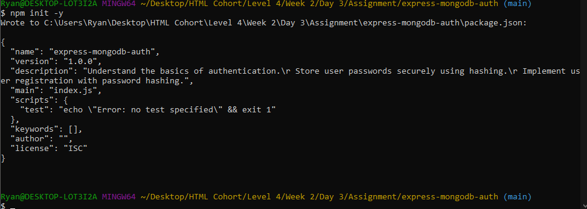
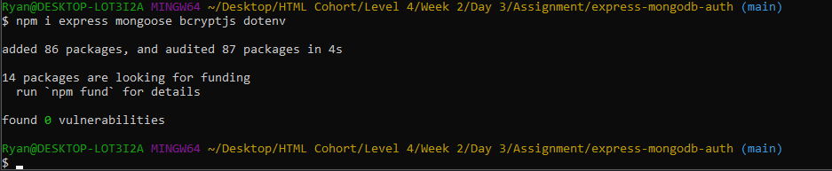
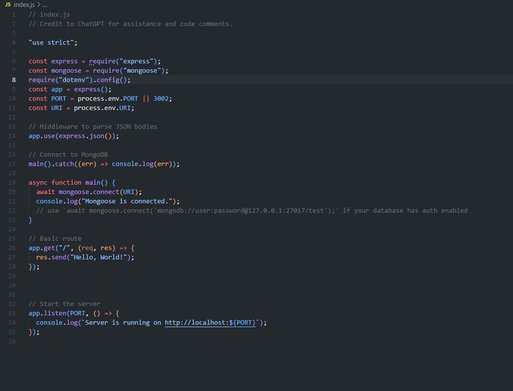
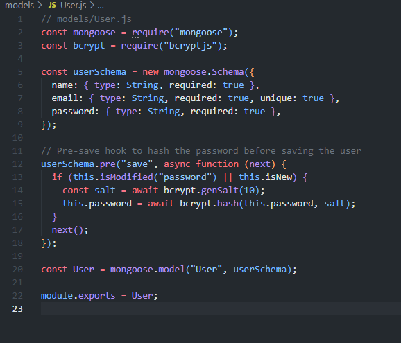
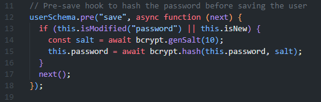
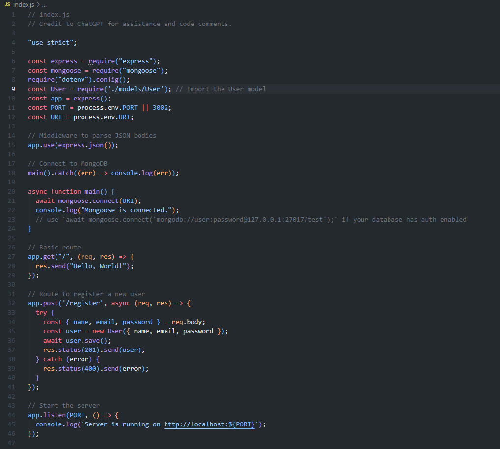
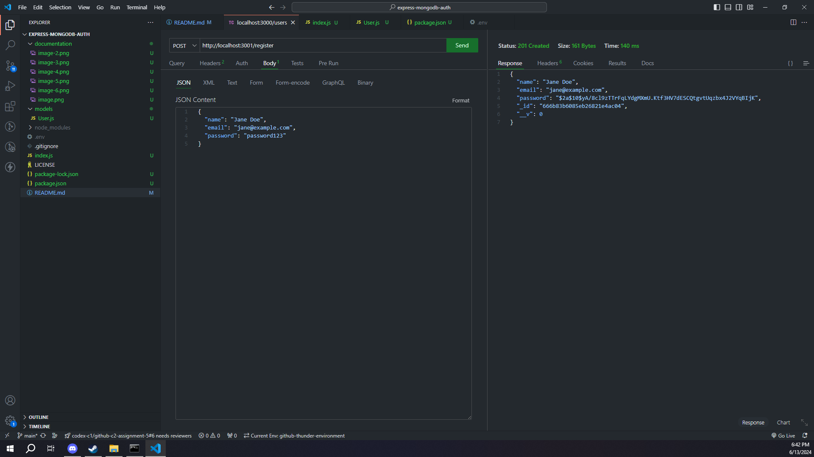
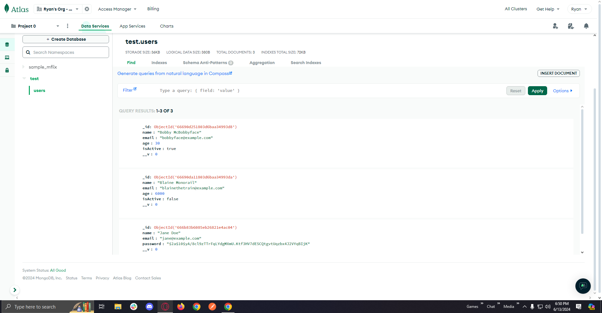

# Objective

Understand the basics of authentication.
Store user passwords securely using hashing.
Implement user registration with password hashing.

# Instructions
## Part 1: Set Up the Project
## Initialize the Project and Install Dependencies:

mkdir express-mongodb-auth
cd express-mongodb-auth
npm init -y
npm install express mongoose bcryptjs  
    
    
  
### Create the Server:

Create a file named index.js and set up a basic Express server with Mongoose connection.  
  

## Part 2: Define the User Schema with Password Hashing
### Create models/User.js:

Define a user schema with the following fields: name, email, and password.  
  

Implement password hashing using bcrypt before saving the user.  
  

## Part 3: Implement Registration Endpoint with Hashed Passwords
### Update index.js to include a registration route:

Route to register a new user with hashed passwords (POST /register).  
  

## Part 4: Test Registration Endpoint with Hashed Passwords
### Start Your Server:

npm run dev

### Test with Thunder Client or Postman:

### Register a User:

Method: POST
URL: http://localhost:3000/register
Body: JSON
{
  "name": "Jane Doe",
  "email": "jane@example.com",
  "password": "password123"
}  
  

### Check the Database:

Connect to your MongoDB database and check the users collection. You should see the user's password stored as a hashed value.

### Take a Screenshot:

Screenshot of the POST request to register a user with hashed passwords.  
  

# Submission
## GitHub Repository: 

Create a new repository named express-mongodb-auth. Push your project to the repository and submit the URL. Ensure it includes all necessary files to run the server, including the README.md.

## Screenshots: 
Include the screenshot of your POST request in the README.md.

# Credits
Credit to ChatGPT for assistance and code comments.